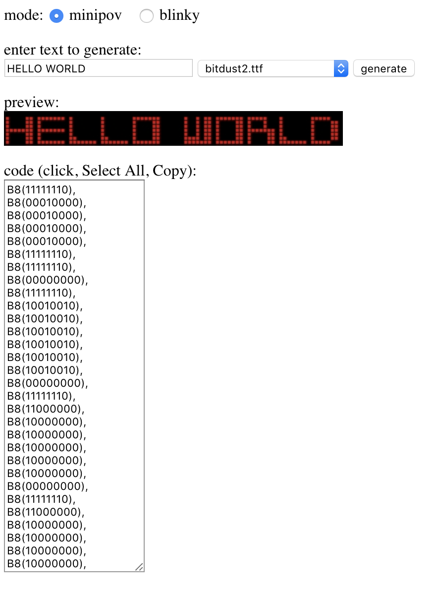

## MiniPOV Code Generator

### Running:
to run locally, under docker:

```
docker run -d -p 8080:80 -v "${PWD}/fonts":/fonts thecase:minipov:latest
```

### Access in local browser:

http://localhost:8080

### Fonts

You'll need to add your own fonts (I didn't include, to avoid potential licensing issues)

Put them in the `fonts/` directory.

### Recommended Fonts:
| font | url |
| -- | -- |
| 04b-08 | https://www.dafont.com/04b-08.font |
| bitdust2 |  https://www.dafont.com/bitdust-two.font |
| bittrip | https://www.dafont.com/bit-trip7.font |
| pixelmix | https://www.dafont.com/pixelmix.font |
| silkscreen | https://www.dafont.com/silkscreen.font |



